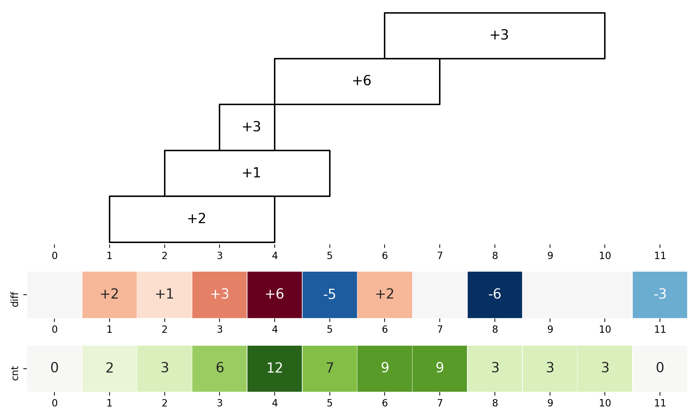

# Diff Array

{badge}`TODO, badge-danger badge-pill`

Opposite to the idea of [prefix sum](prefix-sum.md), which is aimed to evaluate the **changes** on the overall sum through one interval(subarray), a difference array is used to reconstruct the **accumulated sum** at each moment (index) from the **changes** contributed by each **discrete** interval.

```{seealso}
The data structure is often combined with [*sweep line algorithm*](https://en.m.wikipedia.org/wiki/Sweep_line_algorithm): first, we use diff array to record changes on endpoints. Then, the sweep lines help us convert those changes into the origin array by scanning all the indexes in order and accumulating the corresponding difference to the current value so far.
```


## A Typical Scenario

- Given a list of intervals in the format of `[start,end]`. 
- For each interval, a value `num` appears only within it. 
- Ask for the total value `cur` so far at some moments (indexes) frequently.

We can first record changes contributed by each interval to a *diff array* (`diff`) and eventually recover the raw array (`cnt`), which represents the current numbers at every index.

### Example

For example, suppose that our project team has a list of tasks that must be proceeded in the duration`[start,end]` (inclusively):

```
[[1,4],[2,5],[3,4],[4,7],[6,10]]
```

And their required numbers of people are `2,1,3,6,3`, so can you tell me how many people are working at time 7?

Intuitively, as the picture[^0] below shows, we record how many people start to work (+) and leave from work (-) at each moment, which is stored in `diff` array: 



[^0]: For the code used to plot this picture, see [this notebook](https://github.com/li-xin-yi/lctemplates/blob/main/plots/diff-array.ipynb)

then we go back from time `0`, sum up all those changes to get the current value of that time, and finally get the `cnt` array, `cnt[i]` represents the exact number of working people at time `t`. When asked for time 7, we just need to look up the `cnt` array and return `cnt[7]` as 9.  


### Template

The prototype from this idea is written like:

```py
from collections import Counter

# record changes
diff = Counter()
for start,end,num in intervals:
    diff[start] += num
    diff[end+1] -= num

# recover the array from changes
cnt = Counter()
cur = 0
for i in sorted(diff):
    cur += diff[i]
    cnt[i] = cur
```

Though we use the word "array" to describe *diff array* and *raw array*, in many problems, the array is **sparse**: the indexes span a large range, but changes only occur at a few of them. Instead of *linear lists* (array/linked list), It costs littler space to use `dict` to simulate some indexes with changes in order. When querying the value at an index `k` in the raw array, we need to first find the largest index `idx<=k` as:

```py
from bisect import bisect_right
keys = sorted(diff)
idx = bisect_right(cnt,k)
k_value = diff[keys[idx-1]] if idx>0 else 0
```

If the queried index `k` is smaller than any recorded index, that means nothing is observed at that time, for which we return initial value 0.


````{note}
Unlike [`map`](https://www.cplusplus.com/reference/map/map)/[`multimap`](https://www.cplusplus.com/reference/map/multimap/) in C++ or [`treemap`](https://docs.oracle.com/javase/8/docs/api/java/util/TreeMap.html) in Java, `collections.Counter` and its superclass `dict` **don't guarantee keys ordered**: for Python<=3.6, `dict` has totally unordered keys without any assumption[^1]; after Python 3.7, it just maintains an *insertion order*[^2] instead of the comparison of values. Therefore, for both Python and Python3, to simulate the ascending order of array indexes, we must sort the keys in `diff` first by `sorted(diff)` or `sorted(diff.keys())`.  
````

[^1]: Changelog of Python 3.6 mentions that *the order-preserving aspect of this new implementation is considered an implementation detail and should not be relied upon*, see https://docs.python.org/3.6/whatsnew/3.6.html#whatsnew36-compactdict

[^2]: see https://docs.python.org/3.7/tutorial/datastructures.html#dictionaries

For this *sparse* implementation of diff array problems, suppose that there are `n` intervals in total:

- Get the diff array[^3]:
  - **Time complexity**: $O(n)$
  - **Space complexity**: $O(n)$
- Reconstruct the raw array:
  - **Time complexity**: $O(n\log(n))$, because we need to sort those indexes with changes in `diff`
  - **Space complexity**: $O(n)$
- Get the raw value at an index `k` (obtained `keys` list from the previous step):
  - **Time complexity**: $O(\log(n))$, we can use binary search to locate the index in the simulated array
  - **Space complexity**: $O(1)$


[^3]: We take the [average complexity](https://wiki.python.org/moin/TimeComplexity) ($O(1)$) of insertion and accessing the item by an index for `dict` in this case. For the worst case, the complexity of a hash set could be $O(n)$ for both operations, but usually, we rarely come across and talk about those worst cases. Just a reminder: when analyzing the upper bound of complexity for some explicit problems involved with *hashmap*, don't take $O(1)$ for granted.
