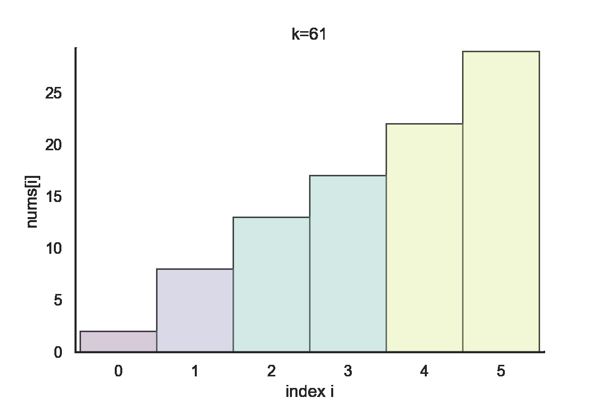

# Miscellaneous

For some topics that I have no idea where to archive but may be helpful.

## Load Balancer Problem

I first came across the problem in a coding challenge hosted by Amazon, which is not public. Thus I can't find the origin problem on the Internet after the challenge, but I can briefly describe the problem:

> There are `n` CPUs in use for several tasks, represented by an array `cpu` of length `n`. `cpu[i]` denotes that there are still `cpu[i]` tasks now in queue for `i`-th CPU to complete. You need to assign `k` incoming tasks to those CPUs, that is, push those tasks into queues of different CPUs. How can you make loads of CPUs **as balanced as possible**? The measurement of balance is calculated by `max(cpu)-min(cpu)`, which should be mininized after your assigment.

I can further model this kind of problem as:

> Given an int array `nums` of length `n`, you are asked to do the following operation `k` times: choose an index `i` in `[0...n)` and increase (or decrease) `nums[i]` by 1. How to make the modified `nums` as **balanced** as possible?

How to understand the word _balanced_? Besides minimizing `max(cpu)-min(cpu)`, Many popular objectives can also be reduced to the "balance" problem intuitively on LeetCode, for example:

- [LC2233](https://leetcode.com/problems/maximum-product-after-k-increments/): To **maximize the product** of the entire array.
- [LC2333](https://leetcode.com/problems/minimum-sum-of-squared-difference/): To **minimize the sum of squared** values in the entire array.

### Heap

A very straight-forward way is to emulate the "balancer" literally, increase (or decrease) the min (max) element in the current array by 1 each time:

````{tabbed} Increase
```py
heapq.heapify(nums)
for _ in range(k):
    num = heapq.heappop(nums)
    heapq.heappush(nums,num+1)
```
````

````{tabbed} Decrease
```py
nums = [-i for i in nums]
heapq.heapify(nums)
for _ in range(k):
    num = heapq.heappop(nums)
    heapq.heappush(nums,num+1)
nums = [-i for i in nums]
```
````

A heap is used to find the min value after updating each time. `nums` is the final array after modification, but the order is not preserved. The time complexity is $k\log(n)$. When `k` is small, the code is so clean and efficient. Still, when k increases, it may not be accepted anymore, which motivates us to consider a larger step instead. When there are still `k` times left,the min number will be assigned to at least $\lfloor k/n \rfloor$ times of +1 operations in the future beacuse the larger number so far must accept fewer +1 operations in emulation.

````{tabbed} Increase
```py
n = len(nums)
heapq.heapify(nums)
while k>0:
    step = max(k//n,1)
    num = heapq.heappop(nums)
    heapq.heappush(nums,num+step)
    k -= step
```
````

````{tabbed} Decrease
```py
n = len(nums)
nums = [-i for i in nums]
heapq.heapify(nums)
while k>0:
    step = max(k//n,1)
    num = heapq.heappop(nums)
    heapq.heappush(nums,num+step)
    k - =step
nums = [-i for i in nums]
```
````

### Counting Sort

Of course, instead of heap, we can use a counter to represent the distrubition of `nums` by values. Each time we shift the min number by 1 and keep track of the min number:

````{tabbed} Increase
```py
from collections import Counter
cnt = Counter(nums)
min_num = min(cnt)

for _ in range(k):
    cnt[min_num] -= 1
    cnt[min_num+1] += 1
    if cnt[min_num] == 0:
        min_num += 1
cnt += Counter()
nums = cnt.elements()
```
````

````{tabbed} Decrease
```py
from collections import Counter
cnt = Counter(nums)
max_num = min(cnt)

for _ in range(k):
    cnt[max_num] -= 1
    cnt[max_num-1] += 1
    if cnt[max_num] == 0:
        max_num -= 1
cnt += Counter()
nums = cnt.elements()
```
````

- **Time Complexity**: $O(\max(n,k))$

### Sort + Greedy Approach

I don't know how to call the approach, but I always stick to it because it gives a time complexity $O(n\log(n))$ regardless of `k`.

1. Sort the array first
2. Traverse the array from the second element: for every `nums[i]`, try to refill all previous `i` elements (their values are all `nums[i-1]`) to the value of `nums[i]`. If it is feasible, just remove the added value `i*(nums[i]-nums[i-1])` from `k` and continue the traversal for next `i`.
3. If the current left k is insufficient to refill them as `nums[i]` for all, just split to all those `i` elements evenly: assume `d=k//i` and `r=k%i`, `r` numbers of `d+1` are added to `r` previous elements while `i-r` numbers of `d` are added to `i-r` previous ones. Now, we can return the final array as

```py
nums = [nums[i-1]+d]*(i-r) + [nums[i-1]+d+1]*r + nums[i:]
```

which is already in a sorted order.

An example of increasing is shown below [^1], in which `nums=[2,8,13,17,22,29]` and `k=61`:

[^1]: To view the plot code of this figure and other internal data, see [this notebook](https://github.com/li-xin-yi/lctemplates/blob/main/plots/load-balancer.ipynb)



So the complete code is:

````{tabbed} Increase
```py
nums.sort()
nums.append(float('inf'))
for i in range(1,len(nums)):
    if i*(nums[i]-nums[i-1]) > k:
        d,r = divmod(k,i)
        return [nums[i-1]+d]*(i-r) + [nums[i-1]+d+1]*r + nums[i:]
    k -= i*(nums[i]-nums[i-1])
```
````

````{tabbed} Decrease
```py
nums.sort(reverse=True)
nums.append(float('-inf'))
for i in range(1,len(nums)):
    if i*(nums[i-1]-nums[i]) > k:
        d,r = divmod(k,i)
        return [nums[i-1]-d]*(i-r) + [nums[i-1]-d-1]*r + nums[i:]
    k -= i*(nums[i-1]-nums[i])
```
````

Usage exmaple: [My solution to LC2233](https://leetcode.com/problems/maximum-product-after-k-increments/discuss/2302400/python-no-heap-maybe-sweepline-onlogn)

## Primes

Though we mentioned a fast factorization algorithm for all numbers $\le$ a given $N$ [here](https://lctemplates.readthedocs.io/en/latest/tips.html#prime-factorization), sometimes we don't need to do factorization during the process, all we need is to enumerate all primes $\le N$. Just use the sieve of Eratosthenes algorithm, which is very simple and efficient.

```py
mask = [False]* 2 + [True] * (N-1)
primes = []
for i in range(2, N+1):
if mask[i]:
    primes.append(i)
    for j in range(i*i, N+1, i):
    mask[j] = False
return [i for i in range(2, N+1) if mask[i]]
```

An example exercise: [Meta Hackercup 2024 Round 1 Problem B](https://www.facebook.com/codingcompetitions/hacker-cup/2024/round-1/problems/B), which can solved by first listing all primes $\le 10^7$ and store the accumulated count of twin primes at every possible query $N$.

## OOD-related Interview Question

For typical OOD problems in interviews, you can refer to [{opticon}`mark-github` tssovi/grokking-the-object-oriented-design-interview](https://github.com/tssovi/grokking-the-object-oriented-design-interview), which includes many study cases of common problems. The key point is not at the problem itself, but keeping communicating and clarifying what is the requirement and what is the constraint.

Besides, some simple OOD problems may also occur. For example, how to implement linked list, vector, stack, double-ended queue, etc. Usually, we often use the built-in data structures in Python. But in interviews, you may be asked to implement them from scratch. Many issues you may come across after used to the Python built-in data structures, the most serious one (just in my opinion) is there is no bare array (though you can use `array.array`), take care of the memory allocation and deallocation, and the time complexity of operations when you use `list` to simulate it and don't forget to assume it has all features of an array if needed.
