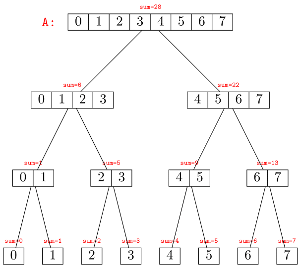

# Segment Tree

{badge}`TODO, badge-danger badge-pill`

## What is a segment tree?

Imagine that you are given an array of integers, namely `A`, of length `n`. There are totally $2^n-1$ non-empty subarries, written as `A[i:j+1]` with `0<=i<=j<n`. To maintain some statistics (e.g. sum, min, max and etc.) about each subarrey for further queries, we have some straightforward solutions:

- If we naively keep all $2^n-1$ subarries physically, we need $O(n^2)$ spaces, while every time we need to query some information about a specified interval `[i,j]`, it costs $O(1)$ time. However, if you need to update a single element in `A`, to keep all data about all intervals up-to-date, you still need $O(n^2)$ time to update all intervals containing the element. 
- In opposite, if we only keep every single element for each index (every `A[i]`), in other words, `n` intervals of length 1, as what a built-in array exactly does, we only require $O(n)$ space to build them and $O(1)$ to update any single element. But the time cost for each query of interval data increases to $O(n)$.
- ...

Yes, as you see, this is a **trade-off** between **space and time**, as well as a **trade-off** between **construction**, the following **updates**, and **queries**. A [segment tree](https://en.wikipedia.org/wiki/Segment_tree) is designed to balance those costs and break the dilemma, which offers better performance to build the array quickly and supports **numerous** times of both *update* and *query* operations. 

We build a segment tree from an array by recursively dividing every subarray `[left,right]` into two smaller subarries as `[left,mid]` and `[mid+1,right]`, where `mid=(left+right)//2`. Every subarray `[left,right]` is represented as a TreeNode, with left child `[left,mid]` and right child `[mid+1,right]`. For example, assume we have an array `A` initialized as:

```
A = [0, 1, 2, 3, 4, 5, 6, 7]
```

First, we build the segment tree as the picture below and track the sum of every subarry represented by a TreeNode. We start to talk about segment trees from a very special case, as a [perfect binary tree](https://www.programiz.com/dsa/perfect-binary-tree):



We see that we create `2n-1` TreeNodes for different subarries. The **leaf** nodes are used to store **single** elements (interval `[i,i]`). For each query or update request, we go through a [post-order DFS](https://en.wikipedia.org/wiki/Tree_traversal#Post-order,_LRN) from the root of the entire tree (the array `[0,n-1]`). For example, in the case above, every `sum` value for each TreeNode is calculated by adding the `sum` of two child nodes. Therefore, whenever we request to update a single element `A[i]` contained in either child node, we must first traverse to any TreeNode that includes this index `i` and then go to one of its children. After any child node is modified, the `sum` of the parent node must also be re-calculated by adding the two updated `sum` of its children.