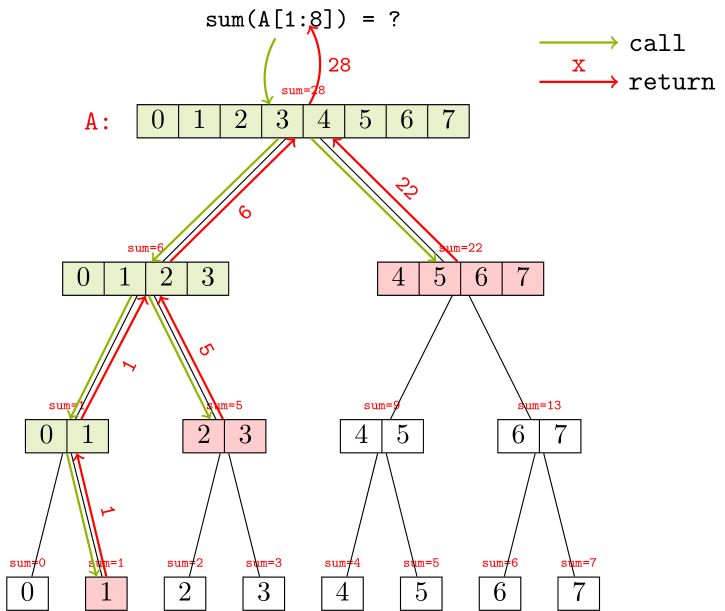

# Segment Tree

{badge}`TODO, badge-danger badge-pill`

## What is a segment tree?

Imagine that you are given an array of integers, namely `A`, of length `n`. There are total ${{n+1} \choose 2} = n(n+1)/2$ non-empty subarrays, written as `A[i:j+1]` with `0<=i<=j<n`. To maintain some statistics (e.g. sum, min, max and etc.) about each subarray for further queries, we have some straightforward solutions:

- If we naively keep all $n(n+1)/2$ subarrays physically, we need $O(n^2)$ spaces, while every time we need to query some information about a specified interval `[i,j]`, it costs $O(1)$ time. However, if you need to update a single element in `A`, to keep all data about all intervals up-to-date, you still need $O(n^2)$ time to update all intervals containing the element.
- In opposite, if we only keep every single element for each index (every `A[i]`), in other words, `n` intervals of length 1, as what a built-in array exactly does, we only require $O(n)$ space to build them and $O(1)$ to update any single element. But the time cost for each query of interval data increases to $O(n)$.
- ...

Yes, as you see, this is a **trade-off** between **space and time**, as well as a **trade-off** between **construction**, the following **updates**, and **queries**. A [segment tree](https://en.wikipedia.org/wiki/Segment_tree) is designed to balance those costs and break the dilemma, which offers better performance to build the array quickly and supports **numerous** times of both _update_ and _query_ operations.

We build a segment tree from an array by recursively dividing every subarray `[left,right]` into two smaller subarrays as `[left,mid]` and `[mid+1,right]`, where `mid=(left+right)//2`. Every subarray `[left,right]` is represented as a TreeNode, with left child `[left,mid]` and right child `[mid+1,right]`. For example, assume we have an array `A` initialized as:

```
A = [0, 1, 2, 3, 4, 5, 6, 7]
```

First, we build the segment tree as the picture below and track the sum of every subarray represented by a TreeNode. We start to talk about segment trees from a very special case, as a [perfect binary tree](https://www.programiz.com/dsa/perfect-binary-tree):


We see that we create `2n-1` TreeNodes for different subarrays. The **leaf** nodes are used to store **single** elements (interval `[i,i]`). For each query or update request, we go through a [post-order DFS](https://en.wikipedia.org/wiki/Tree_traversal#Post-order,_LRN) from the root of the entire tree (the array `[0,n-1]`). For example, in the case above, every `sum` value for each TreeNode is calculated by adding the `sum` of two child nodes. Therefore, whenever we request to update a single element `A[i]` contained in either child node, we must first traverse to any TreeNode that includes this index `i` and then go to one of its children. After any child node is modified, the `sum` of the parent node must also be re-calculated by adding the two updated `sum`s of its children.

```{note}
Even though each node in the picture is depicted as a subarray, remember that it is **just for demonstration**. a TreeNode never stores any specific value of elements in the interval `[i,j]`, instead it only keeps track of some information about the interval (e.g., `sum` in this case) and pointers to its children, which always take up $O(1)$ space for each TreeNode.
```

Let's talk about querying the `sum` of an interval `[i,j]`, which may not be represented exactly by any single TreeNode in the tree right now. For example, if we want to query `sum(A[1:8])`, we need to start a traversal like:



Start from the root node, we search for the intervals:

- If current node is completely contained in `[1,7]`, just return the `sum` of it.
- If the left half of the interval represented by current node, search the left child and add the returned `sum` of it to current result.
- Similarly, if the right half of the interval represented by current node, search the right child and add the returned `sum` of it to current result.

## Template (for fixed `n`-length array)

### Initialize

If you have already confirmed that it is a fixed `n`-length array and you want to build a segment tree for it, you can represent such a binary tree by a 1-D array. The height of such a binary tree is $\lceil \log n \rceil$, which can have $2^{(\lceil \log n \rceil + 1)} - 1 \le 4n - 1$ at most. Thus, we usually create an array of length `4n` to represent nodes in that segment tree.

For example, if we are only interested in info including `sum`, `min` and `max` of each interval, we create a `4n`-length array for each of them.

```py
class SegTree:
    def __init__(self, n:int):
        self.n = n
        self.sum = [0]*(4*n)
        self.min = [0]*(4*n)
        self.max = [0]*(4*n)
```

Recall that how we use a linear array `nodes` to represent a binary tree (index from 1): if a node is stored at `nodes[i]`, then its left child node is stored at `nodes[2*i]` while its right child node is stored at `nodes[2*i+1]`.

### Build from Array

Then, if we have an array at start and want to build the segment tree from it. We use `build(self, root:int,l:int, r:int, arr:list)` defined below:

```py
    def build(self, root:int,l:int, r:int, arr:list) -> None:
        if l == r:
            self.sum[root] = arr[l]
            self.min[root] = arr[l]
            self.max[root] = arr[l]
            return
        mid = (l+r)//2
        self.build(root*2, l, mid, arr)
        self.build(root*2+1, mid+1, r, arr)
        self.sum[root] = self.sum[root*2] + self.sum[root*2+1]
        self.min[root] = min(self.min[root*2], self.min[root*2+1])
        self.max[root] = max(self.max[root*2], self.max[root*2+1])
```

- `root`: current root node of the subtree to build, represented as an int
- `l` and `r`: the subarray `arr[l:r+1]` that we need to build the segment tree
- **Time complexity**: $O(n)$

When initialize the segment tree with an known array, we can use `self.build(1,0,n-1,arr)`. Note that we always start a tree rooted at node `1` because it gives the correct indexes of child nodes using the formula above (instead `0` can't).

### Update (Single Element)

To update the value of a **single** element in the array, we first need to find all intervals that contains that element, which must be a path from the root node to a leaf.

```py
    def update(self, root:int, l:int, r:int, idx:int, val:int) -> None:
        if l == r:
            self.sum[root] = val
            self.min[root] = val
            self.max[root] = val
            return
        mid = (l+r)//2
        if idx <= mid:
            self.update(root*2, l, mid, idx, val)
        else:
            self.update(root*2+1, mid+1, r, idx, val)
        self.sum[root] = self.sum[root*2] + self.sum[root*2+1]
        self.min[root] = min(self.min[root*2], self.min[root*2+1])
        self.max[root] = max(self.max[root*2], self.max[root*2+1])
```

- `root`: current root node of the subtree that represents the current interval
- `l` and `r`: the endpoints of the current interval
- `idx`: the index of element in the raw array to update
- `val`: the value used to update the element at `idx`
- **Time Complexity:** $O(\log n)$
- **Entry**: `self.update(root=1,l=0,r=n-1,idx=idx,val=val)`

### Query

To query some data (e.g., `sum` here) of an interval `[L,R]`, we search the intervals level by level:

1. if the current intevals is totally included in `[L,R]`, just return the data of it.
2. if not, check if the left child (`[L,mid]`) and the right child (`[mid+1,R]`) recursively.

```py
    def query_sum(self, root:int, l:int, r:int, L:int, R:int) -> int:
        if l >= L and r <= R:
            return self.sum[root]
        mid = (l + r) / /2
        res = 0
        if L <= mid:
            res += self.query_sum(root*2, l, mid, L, R)
        if R > mid:
            res += self.query_sum(root*2+1, mid+1, r, L, R)
        return res
```

- `root`: current root node of the subtree that represents the current interval
- `l` and `r`: the endpoints of the current interval
- `L` and `R`: the endpoints of the interval to query
- **Time Complexity:** $O(\log n)$
- **Entry**: `self.query_sum(root=1,l=0,r=n-1,L=L,R=R)`

## Lazy Propagation

To update a range of elements in the array, we don't have to update every single element in the range. Instead, we can update the interval represented by a TreeNode and mark it as `lazy` to indicate that its children are not up-to-date. When we need to query the data of a TreeNode, we first check if it is `lazy` and update its children if necessary.

## Read More

See [^1]

[^1]: https://cp-algorithms.com/data_structures/segment_tree.html
